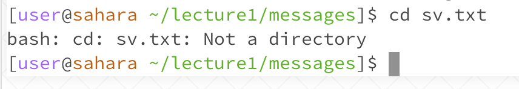

# **"cd" Command**  

## Example using no arguments  

* Working directory: /home
* Error: none
* The example above demonstrates when there are no arguments given (ie. file paths) for the cd function. When no path is given, the cd command will keep the same working directory as before. 

## Example using path to a directory  

* Working directory: /home
* Error: none
* By giving the command "cd" followed by the path to a working directory in the "messages" folder, the working directory is now set to */home/lecture1/messages* instead of */home*.

## Example using path to a file  

* Working directory: /home/lecture1/messages
* Error: An error was thrown because you cannot set your working directory to a file path.
* The output resulted in an error because the file path used after the "cd" command is not the path to a directory.

[Next](https://margaretwj.github.io/cse15l-lab-reports/new.html)
