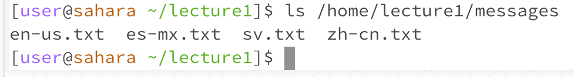

# **"cd" Command**  

**Example using no arguments**  

* Working directory: /home
* Error: none
* The example above demonstrates when there are no arguments given (ie. file paths) for the cd function. When no path is given, the cd command will keep the same working directory as before. 

**Example using path to a directory**  

* Working directory: /home
* Error: none
* By giving the command "cd" followed by the path to a working directory in the "messages" folder, the working directory is now set to */home/lecture1/messages* instead of */home*.

**Example using path to a file**  

* Working directory: /home/lecture1/messages
* Error: An error was thrown because you cannot set your working directory to a file path.
* The output resulted in an error because the file path used after the "cd" command is not the path to a directory.

# **ls Command**  

**Example with no arguement**  

* Working directory: /home/lecture1
* Error: none
* Using the ls command with no argument will list out the files and folders of whatever working directory you are in. In this case, /home/lecture1 contains files *Hello.class*, *Hello.java*, *messages*, and *README*. 

**Example using path to a directory**  

* Working directory: /home/lecture1
* Error: none
* Giving the ls command a path that leads to a directory will list out all the files and folders of the given directory. As shown above, the directory for /home/lecture1/messages contains files en-us.txt, es-mx.txt, sv.txt, and zh-cn.txt.

**Example using path to a file**  

* Working directory: /home/lecture1/messages
* Error: none
* When given a file path, the ls command list out the name of the file that is given. In the example above, the file path to the file en-us.txt returns "en-us.txt".

