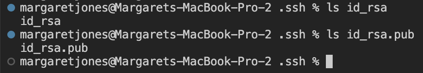
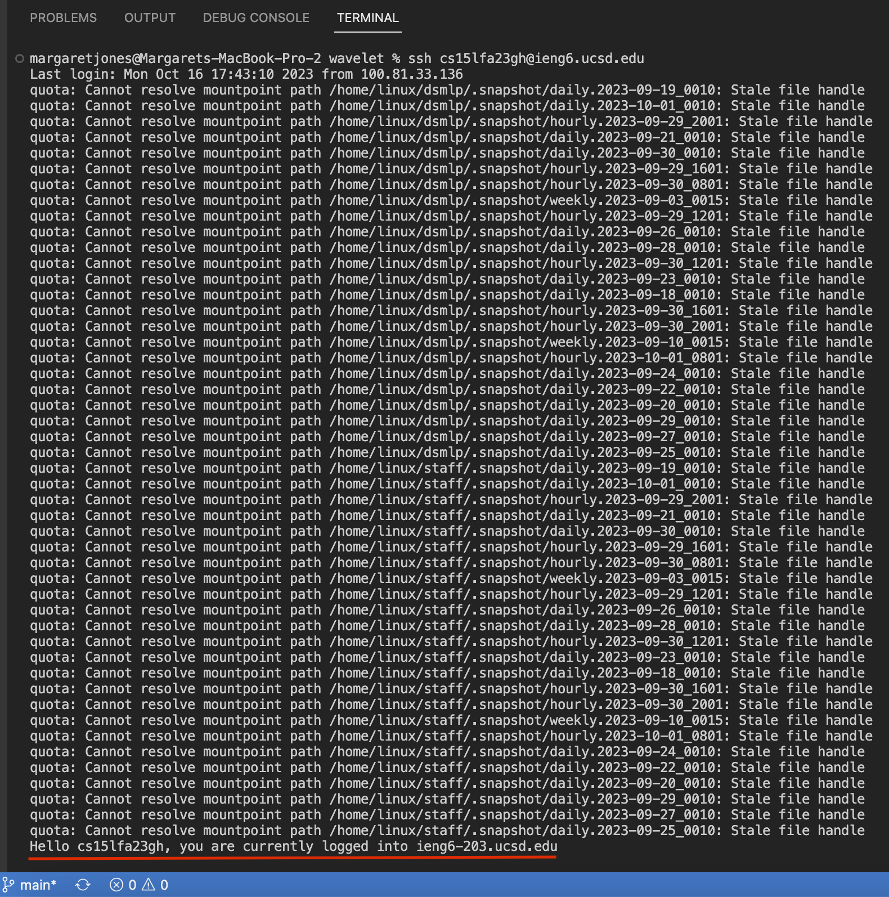

# **Lab Report 2** <br />
Margaret Jones <br />
Monday 4PM - 6PM <br />

## **PART 1** 

## **StringServer Code:** <br />
```
import java.io.IOException;
import java.net.URI;

class Handler implements URLHandler {
    String stringData = ""; //string to keep track of added messages
    Integer num = 1; //int to keep track of list numbering

    public String handleRequest(URI url) {
        if (url.getPath().equals("/")) { //case when no message is added
            return String.format("%s", stringData);
        } else if (url.getPath().contains("/add-message")) { 
            String[] parameters = url.getQuery().split("=");
            if (parameters[0].equals("s")) {
                String message = parameters[1]; //add users message to stringData
                stringData += String.format("%d. %s\n", num, message); 
                num += 1; 
                return stringData;
                }
            } return "404 Not Found!";
    }
}
class StringServer {
    public static void main(String[] args) throws IOException {
        if(args.length == 0){
            System.out.println("Missing port number! Try any number between 1024 to 49151");
            return;
        }

        int port = Integer.parseInt(args[0]);

        Server.start(port, new Handler());
    }
}
```
## **add-message ex. 1**
.png)
* The **handleRequest(URI url) method** is being called when using this example of add-message.
* The relevant argument for this example is the url path used to implement the change which is at the top of the screenshot (https://0-0-0-0-4000-3d6cm9eirt3f4tve85mtlj5l3c.us.edusercontent.com/add-messages?s=Bonjour). The part of this URL that inacts change is the path and query: **"add-messages?s=Bonjour"**. Additionally, the relevant fields of the class are **stringData** and **num** which keep track of the messages that the user of the server inputs and the number of strings that are added.
* When given the request: *add-message?s=Bonjour*
*     stringData changes from "" to "Bonjour"
*     num changes from the integer, 1 to 2 

## **add-message ex. 2**
.png)
* The **handleRequest(URI url) method** is being called when using this second example of add-message.
* The relevant argument for this example is the url path used to implement the change which is at the top of the screenshot (https://0-0-0-0-4000-3d6cm9eirt3f4tve85mtlj5l3c.us.edusercontent.com/add-messages?s=monde). The part of this URL that inacts change is the path and query: **"add-messages?s=monde"**. Additionally, the relevant fields of the class are **stringData** and **num** which keep track of the messages that the user of the server inputs and the number of strings that are added.
* When given the request: *add-message?s=monde*
*     stringData changes from "1. Bonjour\n2. tout\n3.le\n" to "1. Bonjour\n2. tout\n3.le\n4. monde"
*     num changes from the integer, 4 to 5

# **Part2** <br />

## **id public and private**

Using the path */Users/margaretjones/.ssh* I was able to find both the private key (id_rsa) and public key (id_rsa.pub) for my SSH key to login to ieng6. 

## **Login to course-specific account on ieng6 without the password:** <br />


# **Part3** <br />

This week in lab, I learned how to use the command "scp" in order to copy a directory from one server into another. This command does so by using ssh and a file path from another server to securely copy the directory or files. We learned about this command while setting up our SSH keys to login to our course specific account in ieng6 without having to enter the password every time. 
