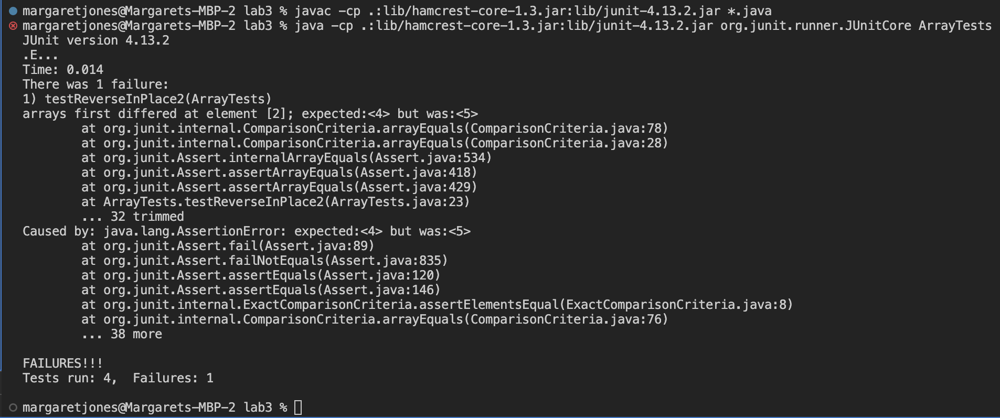
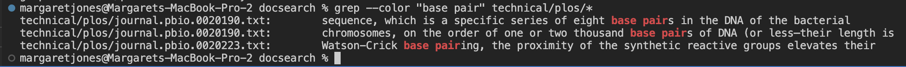
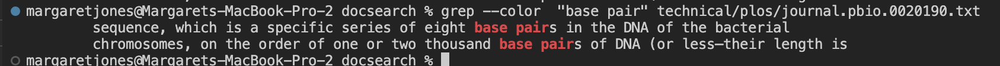
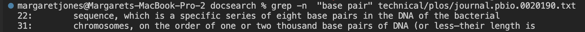
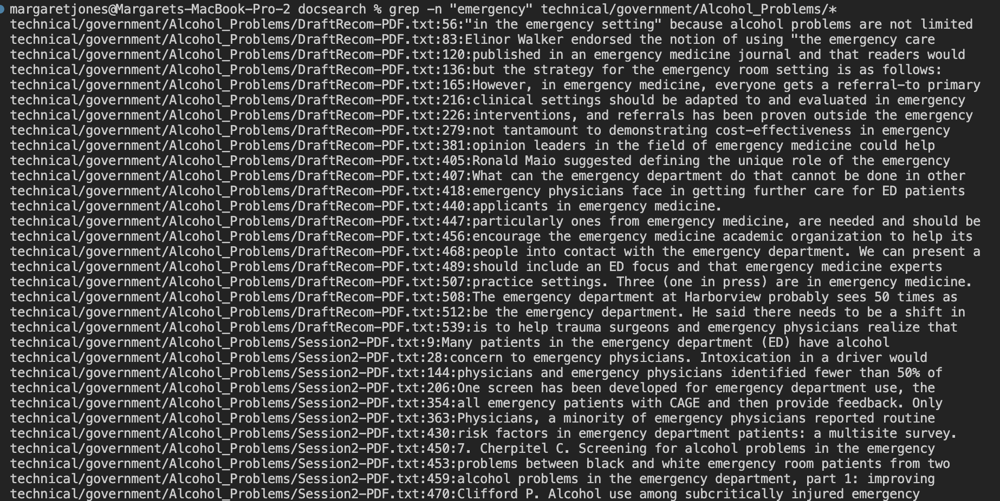
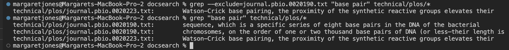
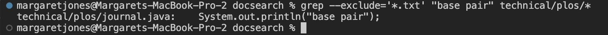
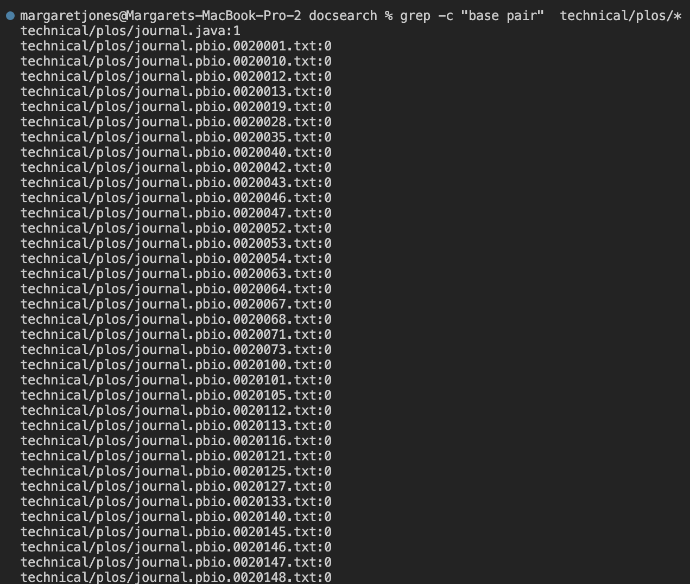
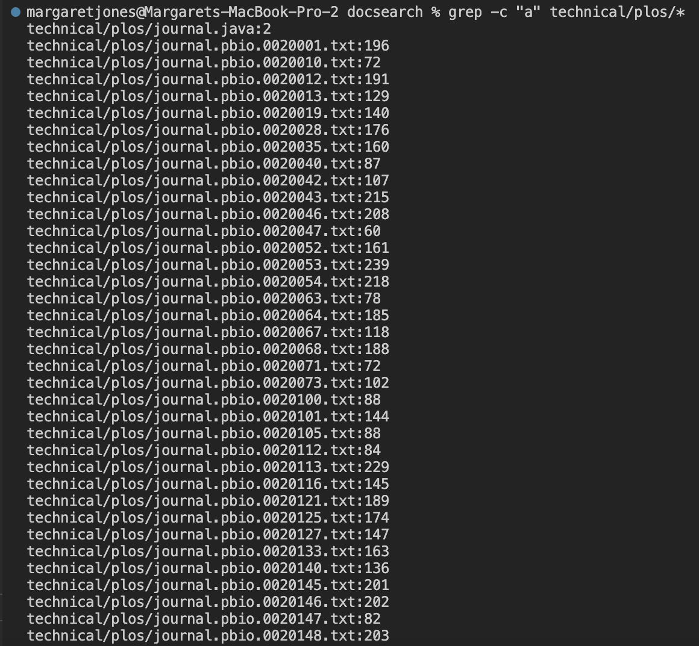

# **Lab Report 3** <br />
Margaret Jones <br />
Monday 4PM - 6PM <br />

## **PART 1 - ReverseInPlace Bug**
* **Failure inducing input:** the non-empty integer array {3, 4, 5, 6}
* Failure inducing test code:
  ```  @Test
  public void testReverseInPlace2() {
    int[] input2 = {3, 4, 5, 6};
    ArrayExamples.reverseInPlace(input2);
    assertArrayEquals(new int[]{6, 5, 4, 3}, input2);
  }
  ```
* **Non-failure inducing input:** the non-empty integer array { 3 }
* Non-failure inducing test code:
  ``` 	@Test 
	public void testReverseInPlace() {
    int[] input1 = { 3 };
    ArrayExamples.reverseInPlace(input1);
    assertArrayEquals(new int[]{ 3 }, input1);
	}
  ```
* **Symptom:**


* **The bug:**
* Code before fixing the bug:
  ```
    static void reverseInPlace(int[] arr) {
    for(int i = 0; i < arr.length; i += 1) { 
      arr[i] = arr[arr.length - i - 1];
      }
    }
  ```
* Code after fixing the bug:
  ```
    static void reverseInPlace(int[] arr) {
    int num; //new
    for(int i = 0; i < arr.length/2; i += 1) { //arr.length/2 = new
      num = arr[i]; //new
      arr[i] = arr[arr.length - i - 1];
      arr[arr.length - i - 1] = num; //new
    }
    }
  ```
  * *Explanation of bug fix:* The bug for this code was that the array was being iterated through (arr.length many times) and swapped which then caused an entire half of the array to be ignored. I was able to fix the bug by iterating through the array for arr.length/2 many times and swapping the values for each index on either end of the array from the outside in. A counter, "num" helps keep track of the contents within the first indices that get swapped with the indices in the end half of the array. 
  

## **PART 2 - Researching *grep* Commands**
1. **--color command**
   * [--color Research Source](https://www.digitalocean.com/community/tutorials/grep-command-in-linux-unix)
   * *Example 1:* In the below example, I used the "--color" grep command to highlight all the instances when the string "base pair" appears in the files of the /technical/plos file directory. This command is helpful for searching where the string is specifically in a certain file as opposed to just printing the lines that the string appears in. 
   * *Example 2:* In this example, I used the "--color" grep command to find the same base pair string within a specific file "journal.pbio.0020190.txt". This works similarly as the example above and is useful in locating the specific string within a specific file. 
2. **-n command**
   *  [-n Research Source](https://man7.org/linux/man-pages/man1/grep.1.html)
   *  *Example 1:* The first example uses the "-n" grep command to print out the line number of the string that is being searched for. So in the plos file "journal.pbio.0020190.txt", the string "base pair" is used in line 22 and 31. This is useful in discovering where in relation to the rest of the text a certain string is mentioned. 
   *  *Example 2:* This second example uses the "-n" grep command when given a list of files to search through. In this case, the directory that is given is "technical/government/Alcohol_Problems/*" and the string searched for is "emergency". This command is useful in looking at the overall specific location of a string across multiple files in a directory. 
3. **--exclude command**
   * [--exclude Research Source 1](https://man7.org/linux/man-pages/man1/grep.1.html)
   * [--exclude Research Source 2](https://ioflood.com/blog/grep-exclude-how-to-use-v-to-exclude-words-patterns-or-files-in-grep/)
   * *Example 1:* This first example uses the "--exclude" grep command to find all files with the string "base pair" in the plos directory except for in the file "journal.pbio.0020190.txt". This can be useful for when you want to not include the data from a certain file in your search. 
   * *Example 2:* This example uses the "--exclude" grep command again with almost the same command, except now we are excluding all txt files. I created a "journal.java" file within the plos directory and had the java file print out the test "base pair" to show how this --exclude command doesn't print out any of the txt files that it has in previous examples and now only prints out the newly created java file. This --exclude command is helpful when you want to search while excluding a specific file type. 
4. **-c command**
   * [-c Research Source](https://man7.org/linux/man-pages/man1/grep.1.html)
   * *Example 1:* This example uses the "-c" grep command to print the count of matching lines for the string "base pair" in each file in the technical/plos directory. This is helpful in finding which file talks the most about a certain topic the most. 
   *  *Example 2:* This example uses the "-c" grep command similarly to example 1 but instead uses a much more widely used character "a" as the pattern input to show larger number of counts generated by "-c". For instance, "journal.pbio.0020001.txt has 196 strings containing "a". 

