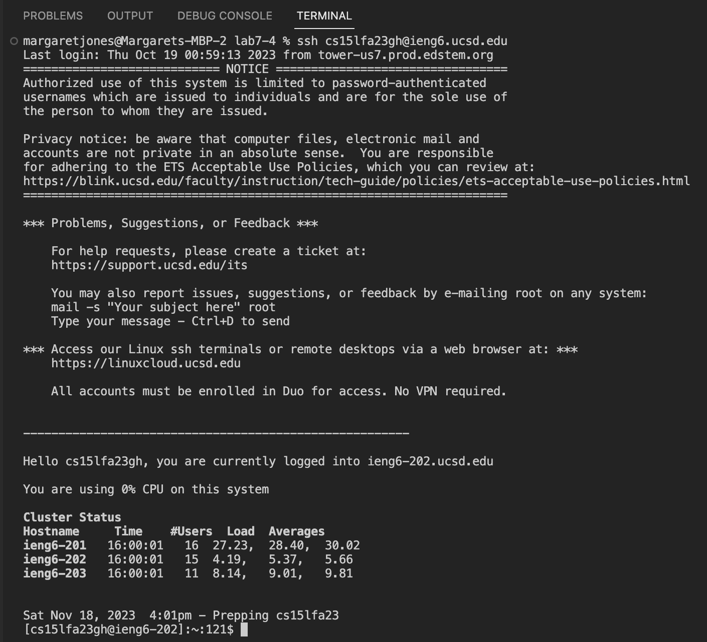

# **Lab Report 4** <br />
Margaret Jones <br />
Monday 4PM - 6PM <br />

## 4. log into ieng6

* **key's pressed:**
  ```s``` ```s``` ```h``` ```<space>``` ```c``` ```s``` ```1``` ```5``` ```l``` ```f``` ```a``` ```2``` ```3``` ```g``` ```h``` ```@``` ```i``` ```e``` ```n``` ```g``` ```6``` ```.``` ```u``` ```c``` ```s``` ```d``` ```.``` ```e``` ```d``` ```u``` ```<enter>```


## 5. Clone your fork of the repository from your Github account (using the SSH URL)

* **key's pressed:**
  ```g``` ```i``` ```t``` ```<space>``` ```c``` ```l``` ```o``` ```n``` ```e``` ```<space>``` navigate to the webpage of my lab-7 fork and click on SSH URL ```<Command-C>``` navigate back to ieng6 terminal ```<Command-V>``` ```<enter>```

## 5. Run the tests, demonstrating that they fail

* **key's pressed:**
  ```b``` ```a``` ```s``` ```h``` ```t``` ```<tab>``` ```<enter>```
