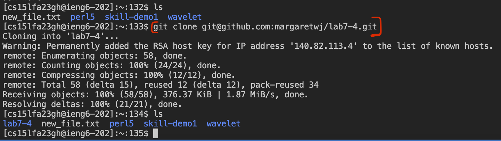
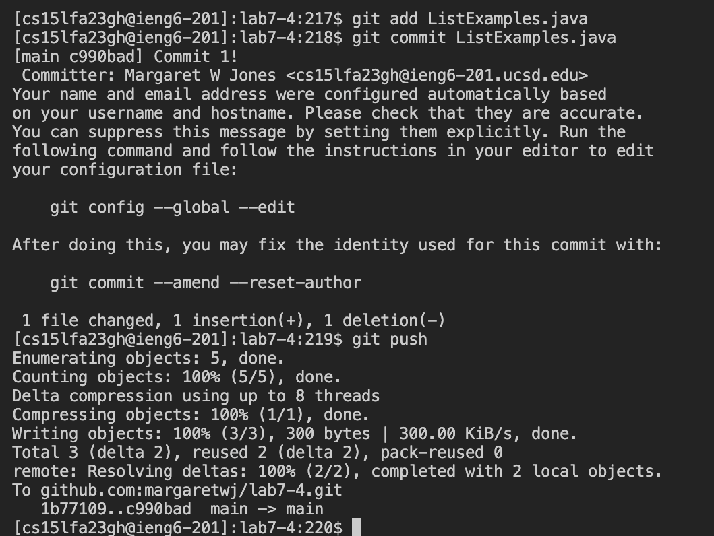

# **Lab Report 4** <br />
Margaret Jones <br />
Monday 4PM - 6PM <br />

## 4. log into ieng6

* **key's pressed:**
  ```s``` ```s``` ```h``` ```<space>``` ```c``` ```s``` ```1``` ```5``` ```l``` ```f``` ```a``` ```2``` ```3``` ```g``` ```h``` ```@``` ```i``` ```e``` ```n``` ```g``` ```6``` ```.``` ```u``` ```c``` ```s``` ```d``` ```.``` ```e``` ```d``` ```u``` ```<enter>```
* Used ssh command and then typed in my entire account name to access ieng6.


## 5. Clone your fork of the repository from your Github account (using the SSH URL)

* **key's pressed:**
  ```g``` ```i``` ```t``` ```<space>``` ```c``` ```l``` ```o``` ```n``` ```e``` ```<space>``` navigate to the webpage of my lab-7 fork and click on SSH URL ```<Command-C>``` navigate back to ieng6 terminal ```<Command-V>``` ```<enter>```
* Used the "git clone" command followed by the SSH URL that I copied from my fork of the lab7 repository on github. 

## 6. Run the tests, demonstrating that they fail

* **key's pressed:**
  ```b``` ```a``` ```s``` ```h``` ```<space>``` ```t``` ```<tab>``` ```<enter>```
* Using the "bash" command to run test.sh in the lab7 directory. Instead of typing out test.sh I used tab to autocomplete the filename.

## 7. Edit the code file to fix the failing test

* ```v``` ```i``` ```m``` ```<space>``` ```L``` ```<tab>``` ```.``` ```j``` ```<tab>``` ```/``` ```c``` ```h``` ```a``` ```n``` ```g``` ```e``` ```<enter>``` ```j``` ```l``` ```l``` ```x``` ```i``` ```2``` ```<ESC>``` ```:``` ```w``` ```q``` ```<enter>```
* Entered vim with ListExamples.java which I typed by using tab to autocomplete ListExamples and java. Then used the search function in normal mode to look for the comment that says to change the index and used j and l to move down and to the right twice to access the index number. Then deleted the "1" with vim command "x", entered insert mode with "i" and typed the correct index. Then exited insert mode with ESC and saved and quit vim with ":wq".

## 8. Run the tests, demonstrating that they now succeed

* ```<up>``` ```<up>``` ```<enter>```
* Since I used "bash test.sh" two commands ago I can use the up arrow twice in the terminal to rerun that same command to rerun the tests and see if they pass.

## 9. Commit and push the resulting change to your Github account

* ```g``` ```i``` ```t``` ```<space>``` ```a``` ```d``` ```d``` ```<space>``` ```L``` ```<tab>``` ```.``` ```j``` ```<tab>``` ```<enter>``` ```g``` ```i``` ```t``` ```<space>``` ```c``` ```o``` ```m``` ```m``` ```i``` ```t``` ```<space>``` ```L``` ```<tab>``` ```.``` ```j``` ```<tab>``` ```<enter>``` ```i``` ```C``` ```o``` ```m``` ```m``` ```i``` ```t``` ```<space>``` ```1``` ```!``` ```<ESC>``` ```:``` ```w``` ```q``` ```<enter>``` ```g``` ```i``` ```t``` ```<space>``` ```p``` ```u``` ```s``` ```h``` ```<enter>```
* Used "git add" and "git commit" command for ListExamples.java which I typed out using tab to autofill again. Once these commands were run, I entered insert mode using "i" to write the commit message: "Commit 1!" and then pressed ESC to exit insert mode. I then saved and quit the commit with :wq and pushed the commit to my fork of Lab7 with the "git push" terminal command. 

