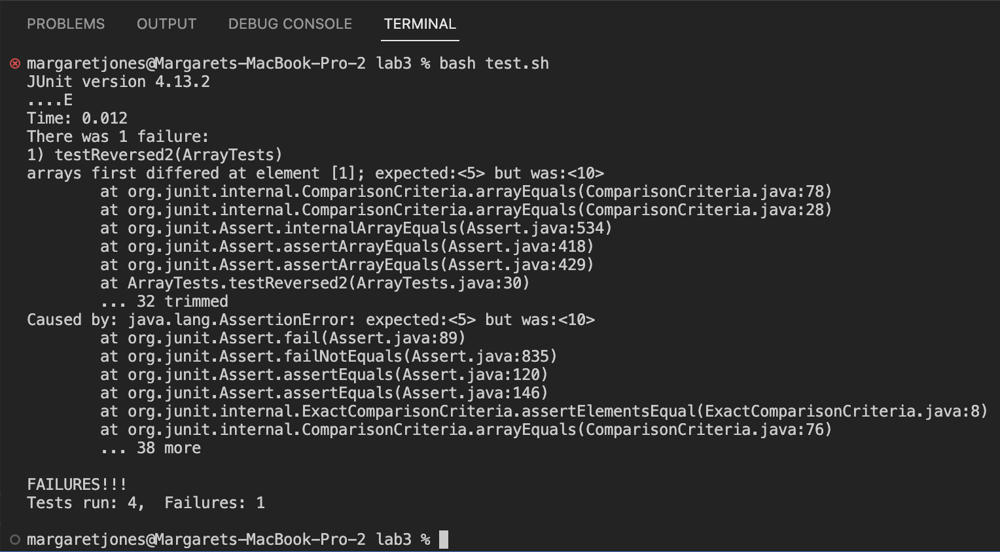
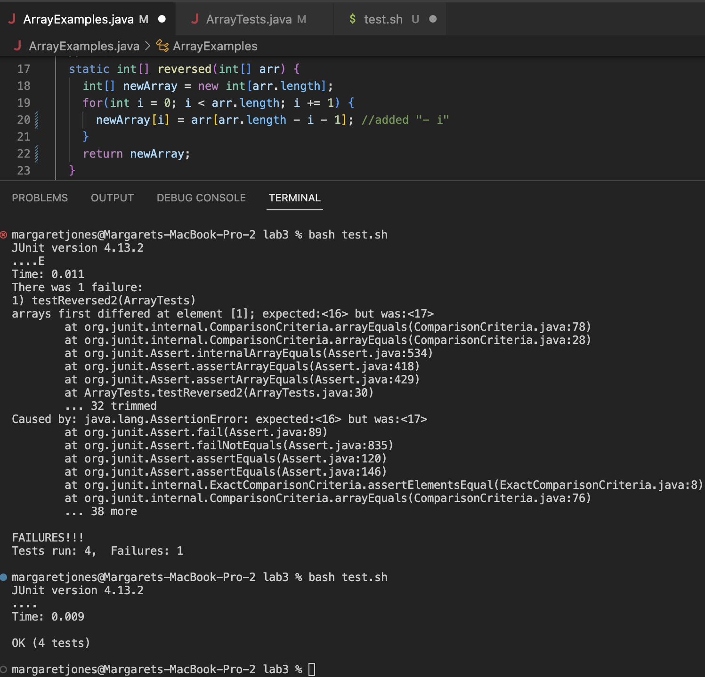

# **Lab Report 5** <br />
Margaret Jones <br />
Monday 4PM - 6PM <br />

# Part 1 - Debugging Scenario

## 1. Original student Edstem post
* *Student message:* "I am getting an error from running the testReversed2(ArrayTests) against my "reversed" method. The test
should says that the method should take the array {5, 10} and reverse it to {10, 5}. The **symptom** is that the test expects 5 but gets 10 which means that the method is incorrectly returning the array {10, 10}. I think that the method is somehow stuck on adding the same index of the old array into the new array I just am unsure where this is happening in the code. I believe it is either the for loop or the body of the for loop. Below, I have attached a screenshot of the symptom. Is there a suggested way for me to solve this bug?"



## 2. A response from a TA asking a leading question or suggesting a command to try
* *TA message:* "Hello, thank you for your question. I would first try a couple larger examples to further determine the pattern. A lot of times this helps give context to examples that are particularly small like the array, {5, 10}. I believe that part of your hypothesis is correct. Think about which part (the for loop or the body of the for loop) is the part that actually assigns the values to the newArray to be returned. These two parts of the for loop should be incrementing by i each iteration."

## 3. Terminal output showing what information the student got from trying that, and a clear description of what the bug is
Student explanation of bug: "I tried a larger example with an array {5, 10, 13, 15, 16, 17} and got the symptom that instead of 16, the output array had a value of 17. Looking back at the code in the body of my for loop, I realized that newArray was not being assigned incremental values of the input array but was instead being assigned the [arr.length - 1] element of the input array for all elements. So the output array for this example was {16, 16, 16, 16, 16, 16} instead of {17, 16, 15, 13, 10, 5}.


## 4. All the information needed about the setup
* File & directory structure needed:
  ```
  --> BUG EXAMPLE
    --> lib
        hamcrest-core-1.3.jar
        junit-4.13.2.jar
    ArrayExamples.java
    ArrayTests.java
    test.sh
  ```
* The contents of each file before fixing the bug:
  * ArrayExamples.java 
* The full command line (or lines) you run to trigger the bug: ``` bash test.sh ```
* Description of what to edit to fix the bug: Navigate to the body of the for loop the "reversed" method in ArrayExamples.java. Instead of the line ```newArray[i] = arr[arr.length - 1];``` subtract "i" from arr.length to the index of arr ```newArray[i] = arr[arr.length - i - 1];``` so that each index of arr is moved into newArray as opposed to only the index at arr.length - 1. 


# Part 2 - Reflection
Learning about jdb was my favorite topic that we learned about in the last half of the quarter because of the ability to stop at a 
certain line in a program and step through each part of the code until you are able to decipher the error. The error we got in lab 
didn't tell us enough about what was going on with the code, but setting a breakpoint and checking the local variables at the 
part of the function we thought was recursive helped us find the bug easily. 

