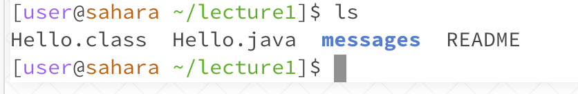

# **ls Command**  

## Example with no arguement

* Working directory: /home/lecture1
* Error: none
* Using the ls command with no argument will list out the files and folders of whatever working directory you are in. In this case, /home/lecture1 contains files *Hello.class*, *Hello.java*, *messages*, and *README*. 

[Next](https://margaretwj.github.io/cse15l-lab-reports/Page3.html)
